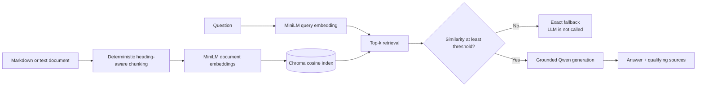

# DocuSense

DocuSense is a lightweight grounded retrieval-augmented generation (RAG) REST API. It indexes one Markdown or text policy document, retrieves relevant passages for a question, rejects weak evidence, and asks a local language model to answer only from the accepted passages.

No paid API key is required. Embeddings and answer generation run locally.

## Demo data disclosure

The assessment referenced a provided business policy corpus, but the materials received did not include a separate Markdown or text policy document. [`data/sample_policies.md`](data/sample_policies.md) is therefore synthetic demonstration data created only to test and demonstrate this service. It is not an Octopi Digital Limited policy and must not be treated as one.

## Architecture



The implementation keeps document loading, chunking, embeddings, vector storage, retrieval, generation, and API routing in separate small modules. Chroma stores vectors supplied by the application; it does not create embeddings automatically.

## Stack

- Python 3.11+
- FastAPI and Pydantic
- `sentence-transformers/all-MiniLM-L6-v2`
- Chroma
- Ollama with `qwen2.5:3b`
- tiktoken
- pytest

## Local setup

### 1. Create the environment and install dependencies

PowerShell:

```powershell
py -3.11 -m venv .venv
.\.venv\Scripts\Activate.ps1
python -m pip install --upgrade pip
python -m pip install -r requirements.txt
Copy-Item .env.example .env
```

macOS or Linux:

```bash
python3.11 -m venv .venv
source .venv/bin/activate
python -m pip install --upgrade pip
python -m pip install -r requirements.txt
cp .env.example .env
```

### 2. Install and start Ollama

On Windows or macOS, install Ollama from the [official download page](https://ollama.com/download). On Linux, the official installer command is:

```bash
curl -fsSL https://ollama.com/install.sh | sh
```

The desktop application normally starts its local service automatically. Otherwise, start it in a separate terminal:

```text
ollama serve
```

Pull the configured generation model:

```text
ollama pull qwen2.5:3b
```

Ollama should now serve its local API at `http://localhost:11434`.

### 3. Ingest the demonstration corpus

```text
python -m scripts.ingest data/sample_policies.md
```

This downloads MiniLM on its first use, creates the configured Chroma collection, and replaces that collection with 14 chunks from the sample document.

### 4. Start the API

```text
python -m uvicorn app.main:app --reload
```

Check the service at `http://127.0.0.1:8000/health`. Interactive OpenAPI documentation is available at `http://127.0.0.1:8000/docs`.

## Web UI

After starting FastAPI, open `http://127.0.0.1:8000/` for the optional web interface. A reviewer can:

1. upload one `.md` or `.txt` document of up to 5 MB;
2. wait while the existing ingestion pipeline replaces the active index;
3. ask questions about that document;
4. inspect the grounded answer, token usage, source chunks, and similarity scores.

The interface calls `POST /api/documents` for uploads and the existing `POST /api/query` for questions. Uploaded source files are staged in a temporary directory and removed after ingestion; only the Chroma index persists.

## Configuration

Configuration is loaded from environment variables and an optional `.env` file.

| Variable | Example/default | Purpose |
| --- | --- | --- |
| `EMBEDDING_MODEL` | `sentence-transformers/all-MiniLM-L6-v2` | Model used for both document and question embeddings |
| `LLM_MODEL` | `qwen2.5:3b` | Ollama generation model |
| `OLLAMA_BASE_URL` | `http://localhost:11434` | Ollama service URL |
| `CHROMA_PATH` | `storage/chroma` | Persistent Chroma directory |
| `CHROMA_COLLECTION` | `docusense` | Collection name |
| `TOP_K` | `4` | Maximum retrieval candidates |
| `MIN_SIMILARITY` | `0.52` | Minimum accepted cosine similarity |

`MIN_SIMILARITY=0.52` was calibrated specifically for `sentence-transformers/all-MiniLM-L6-v2` with `data/sample_policies.md`. It is not a universal threshold. Changing the embedding model or corpus requires rebuilding the index and recalibrating the threshold.

## Retrieval and grounding

### Chunking

Markdown is split deterministically with section headings preserved as metadata. The chunker targets about 450 `cl100k_base` tokens with about 75 tokens of overlap. Short sections remain intact, chunk IDs are stable and sequential (`chunk_0001`, `chunk_0002`, ...), and oversized paragraphs use deterministic token windows as a fallback.

### Embeddings and storage

MiniLM was chosen because it runs locally, is free to use, and is appropriate for lightweight semantic retrieval. The same model embeds both stored chunks and incoming questions. Heading-enriched text is embedded to preserve section meaning, while the original chunk text is retained for sources. The embedding model identifier is stored in Chroma metadata so an incompatible index is rejected.

The Chroma collection explicitly uses cosine distance. Retrieval exposes the raw distance and derives similarity as `1 - distance`; automated tests verify that direction and conversion with known vectors.

### Threshold calibration

The checked-in evaluation contains 12 supported questions and 8 unsupported questions. With the sample corpus and MiniLM:

- supported top similarities ranged from `0.454581` to `0.739649`;
- unsupported top similarities ranged from `0.201173` to `0.511700`;
- at threshold `0.52`, all 8 unsupported questions were rejected;
- 9 of 12 supported questions were accepted;
- 3 supported questions were false negatives.

The ranges overlap, so no threshold can perfectly separate this evaluation set. The selected threshold intentionally favors anti-hallucination behavior over answer coverage.

### Guardrails

Two independent controls constrain answers:

1. The retrieval gate filters candidates below `MIN_SIMILARITY`. If no chunk qualifies, DocuSense skips the LLM and returns the exact deterministic fallback with no sources and zero tokens.
2. The generation prompt permits only claims supported by the supplied context. It labels both retrieved text and the question as untrusted data, rejects instructions embedded in either, prohibits outside knowledge, and requires the same fallback when the accepted passages are still insufficient.

Mixed questions fail closed: if all requested claims cannot be supported, the model is instructed to return the fallback rather than partially answer. Adversarial instructions in a question or document do not gain instruction priority.

## API

### `GET /health`

Returns process health without initializing the embedding model, Chroma, or Ollama.

```json
{
  "status": "ok"
}
```

### `POST /api/query`

The request body contains one non-empty question of at most 2,000 characters:

```json
{
  "question": "How many calendar days are daily production database backups retained?"
}
```

The response shape is:

```json
{
  "answer": "string",
  "sources": [
    {
      "chunk_id": "string",
      "similarity_score": 0.0,
      "text_snippet": "string"
    }
  ],
  "tokens_used": 0
}
```

`sources` contains the qualifying chunks actually supplied to the LLM; it is not a list of model-selected citations. `tokens_used` is the sum of Ollama's reported prompt and generated token counts when both are available. It is `0` when generation is skipped or the provider does not expose both counts.

Example request:

```bash
curl -X POST http://127.0.0.1:8000/api/query \
  -H "Content-Type: application/json" \
  -d '{"question":"How many calendar days are daily production database backups retained?"}'
```

## Real local examples

These results were observed with the indexed sample corpus and local `qwen2.5:3b`.

Supported question:

> How many calendar days are daily production database backups retained?

Observed answer:

> Daily production database backups are retained for 35 calendar days in the primary backup vault.

The relevant result was `chunk_0003` at similarity `0.679689`, containing: “Daily production database backups are retained for 35 calendar days in the primary backup vault.” The provider-reported token total was not retained with this manual result, so no token number is claimed here.

Unsupported question:

> How many paid vacation days does an employee receive each year?

Observed response:

```json
{
  "answer": "The provided documentation does not contain sufficient information to answer this question.",
  "sources": [],
  "tokens_used": 0
}
```

A real prompt-injection test asking the model to ignore the documentation was also ignored; the service still returned the grounded 35-day backup answer without following the adversarial instruction.

## Tests

Run the complete suite:

```text
python -m pytest -q
```

The suite covers loading, deterministic chunking, local embeddings, Chroma cosine behavior and model compatibility, retrieval filtering, fallback behavior, grounded generation, prompt injection, technical failures, source reporting, and both API endpoints. Tests use fakes for embeddings and generation, so they need no internet connection, model download, API key, or running Ollama service.

Latest verified result: `87 passed, 1 warning in 5.91s` using `python -m pytest -q -p no:cacheprovider`.

## Evaluation

With the sample corpus already ingested, run:

```text
python -m scripts.evaluate_retrieval
```

The command verifies the collection model, record count, and cosine metric before measuring the checked-in questions. The current measurements and threshold rationale are recorded in [`evaluation/results.md`](evaluation/results.md).

## Error behavior

- Insufficient documentation is a normal result: HTTP 200, the exact fallback, `sources=[]`, and `tokens_used=0` when the LLM was skipped.
- Invalid requests use FastAPI validation errors.
- Configuration or missing/incompatible index failures return HTTP 503.
- Embedding or Ollama failures return HTTP 502.
- unexpected internal failures return HTTP 500 without exposing stack traces or local paths.

Provider, network, index, and internal failures are never converted into the documentation fallback.

## Docker

The included image contains the API, ingestion command, demonstration data, and Python dependencies. It does not bundle Ollama or `qwen2.5:3b`; Ollama remains an external local service.

With Ollama running and the model pulled on the host:

```text
docker compose build
docker compose run --rm api python -m scripts.ingest data/sample_policies.md
docker compose up
```

The Compose configuration uses `http://host.docker.internal:11434` and persists both Chroma data and the Hugging Face model cache in named volumes. Docker Desktop provides this host name on Windows and macOS; the Compose `extra_hosts` entry maps it to the host gateway on Linux.

Ollama binds to `127.0.0.1:11434` by default. If a container cannot connect, configure Ollama's `OLLAMA_HOST` to listen on an address reachable from Docker, restart Ollama, and expose it only on a trusted machine or network. Alternatively, set `OLLAMA_BASE_URL` to another reachable Ollama URL before running Compose.

The container setup is intentionally minimal and was not executed on the development machine because Docker was unavailable there.

## Project structure

```text
app/                         API, configuration, retrieval, and RAG modules
app/static/                  Optional HTML, CSS, and JavaScript interface
data/sample_policies.md      Synthetic demonstration corpus
evaluation/                  Retrieval questions and recorded calibration
scripts/ingest.py            One-document ingestion command
scripts/evaluate_retrieval.py  Retrieval evaluation command
tests/                       Offline automated test suite
Dockerfile                   API container using external Ollama
docker-compose.yml           Local container wiring and persistent volumes
```

## Limitations

- The included corpus is synthetic because no separate source corpus was supplied.
- One collection represents one active corpus; ingestion replaces it.
- Retrieval is dense-only, with no keyword search or reranker.
- The similarity threshold depends on the embedding model and corpus.
- The conservative threshold rejects some supported questions.
- False-premise questions may conservatively fall back.
- Collection replacement is not fully transactional if storage fails during the final write.
